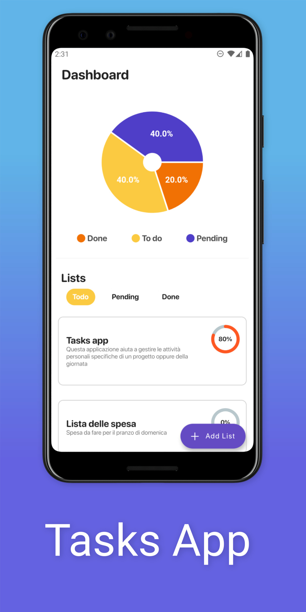
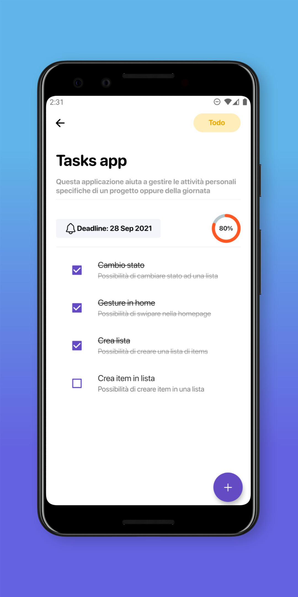

<!--
*** Thanks for checking out the Best-README-Template. If you have a suggestion
*** that would make this better, please fork the spesa-app and create a pull request
*** or simply open an issue with the tag "enhancement".
*** Thanks again! Now go create something AMAZING! :D
***
***
***
*** To avoid retyping too much info. Do a search and replace for the following:
*** leobia, spesa-app, email, Tasks, A flutter application to keep track of projects or daily activities
-->

<!-- PROJECT SHIELDS -->
<!--
*** I'm using markdown "reference style" links for readability.
*** Reference links are enclosed in brackets [ ] instead of parentheses ( ).
*** See the bottom of this document for the declaration of the reference variables
*** for contributors-url, forks-url, etc. This is an optional, concise syntax you may use.
*** https://www.markdownguide.org/basic-syntax/#reference-style-links
-->
[![Contributors][contributors-shield]][contributors-url]
[![Issues][issues-shield]][issues-url]
[![MIT License][license-shield]][license-url]
[![LinkedIn][linkedin-shield]][linkedin-url]

<!-- PROJECT LOGO -->
 

  

   

  <a style="font-size: 9px" href="https://icons8.com/icon/13550/lista-di-cose-da-fare">
    Task list icon by Icons8
  </a>

  <h3 align="center">Tasks</h3>

  

    A flutter application to keep track of projects or daily activities
     
    <a href="https://github.com/leobia/spesa-app/issues">Report Bug</a>
    ·
    <a href="https://github.com/leobia/spesa-app/issues">Request Feature</a>
  

<!-- TABLE OF CONTENTS -->

  
<h2 style="display: inline-block">Table of Contents</h2>

  <ol>
    <li>
      <a href="#about-the-project">About The Project</a>
      <ul>
        <li><a href="#built-with">Built With</a></li>
      </ul>
    </li>
    <li>
      <a href="#getting-started">Getting Started</a>
      <ul>
        <li><a href="#prerequisites">Prerequisites</a></li>
        <li><a href="#installation">Installation</a></li>
      </ul>
    </li>
    <li><a href="#usage">Usage</a></li>
    <li><a href="#roadmap">Roadmap</a></li>
    <li><a href="#contributing">Contributing</a></li>
    <li><a href="#license">License</a></li>
    <li><a href="#contact">Contact</a></li>
    <li><a href="#acknowledgements">Acknowledgements</a></li>
  </ol>

<!-- ABOUT THE PROJECT -->
## About The Project

I developed this project with the intention of learning how to use flutter for mobile development. 'Tasks' is an activity tracker that helps you organize your day and your personal projects.

  
  

### Built With

* [Flutter](https://flutter.dev/)
* [Firebase](https://firebase.google.com/)

## Use the app

To use the app you need to install it on your local phone

### Installation

To install the app on android you can download the right apk for your phone here: [Download](https://github.com/leobia/spesa-app/releases/latest)

<!-- GETTING STARTED -->
## Run the app locally

To get a local copy up and running follow these steps.

### Prerequisites

#### Flutter

You can get started with flutter [here](https://flutter.dev/docs/get-started/install).

#### Firestore
You need to create two apps on firebase console (iOS and Android). You can get started [here](https://firebase.flutter.dev/docs/overview)

### Installation

Once you have followed flutter and firestore configuration guides you should have 2 new files (GoogleService-Info.plist and google-services.json). Then you can simply run the main.dart file with android studio (while having an emulator opened). 

<!-- CONTRIBUTING -->
## Contributing

Contributions are what make the open source community such an amazing place to be learn, inspire, and create. Any contributions you make are **greatly appreciated**.

1. Fork the Project
2. Create your Feature Branch (`git checkout -b feature/AmazingFeature`)
3. Commit your Changes (`git commit -m 'Add some AmazingFeature'`)
4. Push to the Branch (`git push origin feature/AmazingFeature`)
5. Open a Pull Request

<!-- LICENSE -->
## License

Distributed under the MIT License. See `LICENSE` for more information.

<!-- CONTACT -->
## Contact

leonardo.bianco@outlook.com

Project Link: [https://github.com/leobia/spesa-app](https://github.com/leobia/spesa-app)

<!-- MARKDOWN LINKS & IMAGES -->
<!-- https://www.markdownguide.org/basic-syntax/#reference-style-links -->
[contributors-shield]: https://img.shields.io/github/contributors/leobia/spesa-app.svg?style=for-the-badge
[contributors-url]: https://github.com/leobia/spesa-app/graphs/contributors
[issues-shield]: https://img.shields.io/github/issues/leobia/spesa-app.svg?style=for-the-badge
[issues-url]: https://github.com/leobia/spesa-app/issues
[license-shield]: https://img.shields.io/github/license/leobia/spesa-app.svg?style=for-the-badge
[license-url]: https://github.com/leobia/spesa-app/blob/master/LICENSE.txt
[linkedin-shield]: https://img.shields.io/badge/-LinkedIn-black.svg?style=for-the-badge&logo=linkedin&colorB=555
[linkedin-url]: https://linkedin.com/in/leonardo-bianco-dev/
